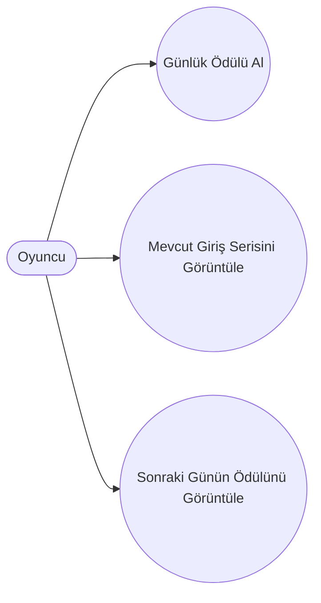

# Use Case Diagram

## Amaç

Bu diyagram, Günlük Giriş Ödül Sistemi kapsamında oyuncunun sistem ile gerçekleştirdiği temel etkileşimleri göstermektedir.

---

# Aktör

* **Oyuncu**

---

# Use Case Diyagramı

---

# Use Case Açıklamaları

| Use Case                        | Açıklama                                                                 |
| ------------------------------- | ------------------------------------------------------------------------ |
| Günlük Ödülü Al                 | Oyuncu, günlük giriş ödülünü talep eder ve sistem uygun ise ödülü verir. |
| Mevcut Giriş Serisini Görüntüle | Oyuncu, kaç gündür düzenli giriş yaptığını görüntüler.                   |
| Sonraki Günün Ödülünü Görüntüle | Oyuncu, bir sonraki gün kazanacağı ödülü görüntüler.                     |

---

# Aktör Açıklaması

| Aktör  | Açıklama                                                  |
| ------ | --------------------------------------------------------- |
| Oyuncu | Günlük giriş ödül sistemini kullanan oyun kullanıcısıdır. |
